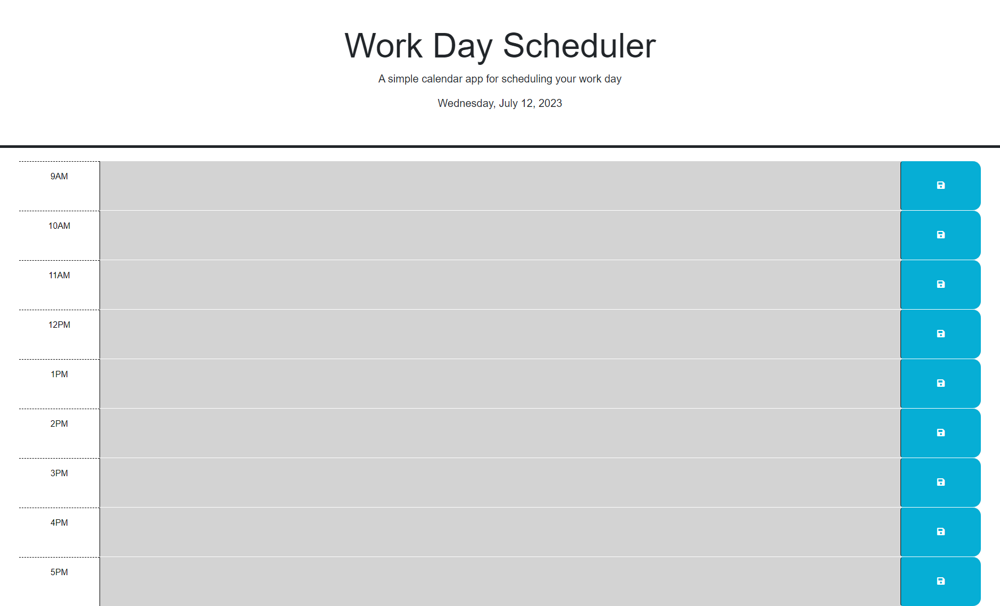

# Daily-Planner

## Description 
This Project is a daily planner to help organize a day more efficiently. This planner will allow you to visually time manage and plan out what
you have going on in a day, it also saves all the info written so even after closing the page everything will still be there. Creating this project helped me understand more about local storage in windows, jquery api concepts and javascript functions.

## Installation
Simply copy the repo into your github and open the code using a code editor such as visual studio, then simply open the html in a browser page,
you may also visit the deployed page below

## Usage 
This site can be used to organize your day by the hour, lets you time manage by telling you what hours have passed and what hour it currently is visually, while also storing the info you`ve written after the page has been closed.

# Credits
Dayjs: https://day.js.org/

jQuery: https://jqueryui.com/

